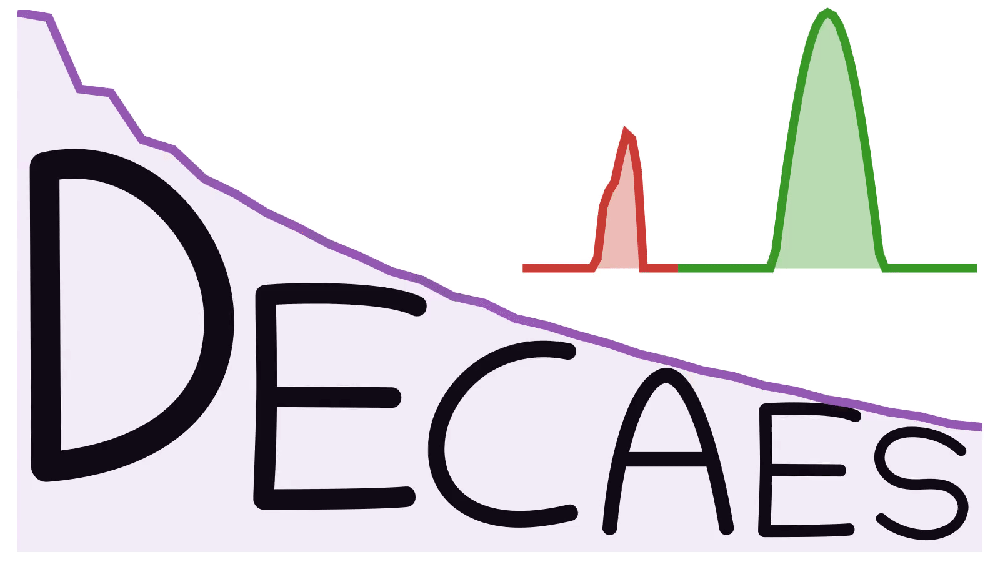

# DEcomposition and Component Analysis of Exponential Signals (DECAES)

<p align="left">  </p>

<!-- [](https://jondeuce.github.io/DECAES.jl/stable) -->
[](https://jondeuce.github.io/DECAES.jl/dev)
[](https://github.com/jondeuce/DECAES.jl)
<a href="https://doi.org/10.1016/j.zemedi.2020.04.001">  </a>
<!-- [](https://doi.org/10.1016/j.zemedi.2020.04.001) -->

[](https://github.com/jondeuce/DECAES.jl/actions/workflows/CI.yml?query=branch%3Amaster)
[](https://codecov.io/github/jondeuce/DECAES.jl/branch/master)

DECAES is a *fast* Julia implementation of the [MATLAB toolbox](https://mriresearch.med.ubc.ca/news-projects/myelin-water-fraction/) from the [UBC MRI Research Centre](https://mriresearch.med.ubc.ca/) for computing voxelwise [T2-distributions](https://doi.org/10.1016/0022-2364(89)90011-5) from multi spin-echo MRI images using the extended phase graph algorithm with stimulated echo corrections.
Post-processing of these T2-distributions allows for the computation of measures such as the [myelin water fraction (MWF)](https://doi.org/10.1002/mrm.1910310614) or the [luminal water fraction (LWF)](https://doi.org/10.1148/radiol.2017161687).

DECAES is written in the open-source [Julia programming language](https://julialang.org/).
Julia and command line interfaces are available through this package.
The [examples repository](https://github.com/jondeuce/mwiexamples) additionally provides a MATLAB interface via the MATLAB function [`decaes.m`](./api/decaes.m).

If you use DECAES in your research, please [cite our work](./CITATION.bib):

* Doucette J, Kames C, Rauscher A. DECAES - DEcomposition and Component Analysis of Exponential Signals. Zeitschrift für Medizinische Physik 2020; 30: 271–278.

## Installation

Using Julia v1.9 or later you can install DECAES as follows:

```bash
$ julia --project=@decaes -e 'import Pkg; Pkg.add("DECAES"); Pkg.build("DECAES")'
```

This will do two things:

1. Add DECAES.jl to a named Julia project environment separate from your global environment
2. Build the `decaes` executable at `~/.julia/bin` for running DECAES from the command line

DECAES can then be run from the command line via `decaes <COMMAND LINE ARGS>`, provided `~/.julia/bin` is added to your `PATH`.
Run `decaes --help` for available arguments.

## Quickstart

If you are new to DECAES, the best place to start is the [examples repository](https://github.com/jondeuce/mwiexamples).
There, we provide:

* A walk-through tutorial for using the MATLAB and command-line DECAES interfaces
* Example multi spin-echo (MSE) data for demonstrating MWI processing

## Documentation

[](https://jondeuce.github.io/DECAES.jl/dev)

Find package documentation at the above link, which includes:

* The command line interface [API](https://jondeuce.github.io/DECAES.jl/dev/cli), available [command line arguments](https://jondeuce.github.io/DECAES.jl/dev/cli/#Arguments-1), and [examples](https://jondeuce.github.io/DECAES.jl/dev/cli/#Examples-1)
* API reference detailing how to use DECAES.jl from within Julia
* Other internals and algorithmic details

## Benchmarks

Due to performance optimizations enabled by Julia, DECAES is *fast*.
As an illustration, here is a comparison between DECAES and [UBC MWF MATLAB toolbox](https://github.com/ubcmri/ubcmwf) T2-distribution computation times for two multi spin-echo (MSE) datasets:

<center>

| Dataset     | Matrix Size     | CPU                | Cores | Threads | MATLAB     | **DECAES** |
| :---:       | :---:           | :---:              | :---: | :---:   | :---:      | :---:      |
| 48-echo MSE | 240 x 240 x 48  | Intel i5 4200U     | 2     | 4       | 4h:35m:18s | **6m:42s** |
| 56-echo MSE | 240 x 240 x 113 | Intel i7-3770K     | 4     | 8       | --         | **5m:39s** |
| 48-echo MSE | 240 x 240 x 48  | Intel i7-3770K     | 4     | 8       | --         | **3m:07s** |
| 56-echo MSE | 240 x 240 x 113 | Intel Xeon E5-2640 | 12    | 24      | 1h:25m:01s | **2m:20s** |
| 48-echo MSE | 240 x 240 x 48  | Intel Xeon E5-2640 | 12    | 24      | 59m:40s    | **1m:24s** |
| 56-echo MSE | 240 x 240 x 113 | AMD Ryzen 9 3950X  | 16    | 32      | 22m:33s    | **34s**    |
| 48-echo MSE | 240 x 240 x 48  | AMD Ryzen 9 3950X  | 16    | 32      | 17m:56s    | **21s**    |

</center>

## DECAES Tutorial 2022

[](https://www.youtube.com/watch?v=xCKWWNywOTw)

## JuliaCon 2021

[](https://www.youtube.com/watch?v=6OxsK2R5VkA)

## Citing this work

If you use DECAES in your research, please [cite our work](https://doi.org/10.1016/j.zemedi.2020.04.001):

```tex
@article{DECAES.jl-2020,
  title = {{{DECAES}} - {{DEcomposition}} and {{Component Analysis}} of {{Exponential Signals}}},
  author = {Doucette, Jonathan and Kames, Christian and Rauscher, Alexander},
  year = {2020},
  month = may,
  issn = {1876-4436},
  doi = {10.1016/j.zemedi.2020.04.001},
  journal = {Zeitschrift Fur Medizinische Physik},
  keywords = {Brain,Luminal Water Imaging,MRI,Myelin Water Imaging,Prostate},
  language = {eng},
  pmid = {32451148}
}
```
