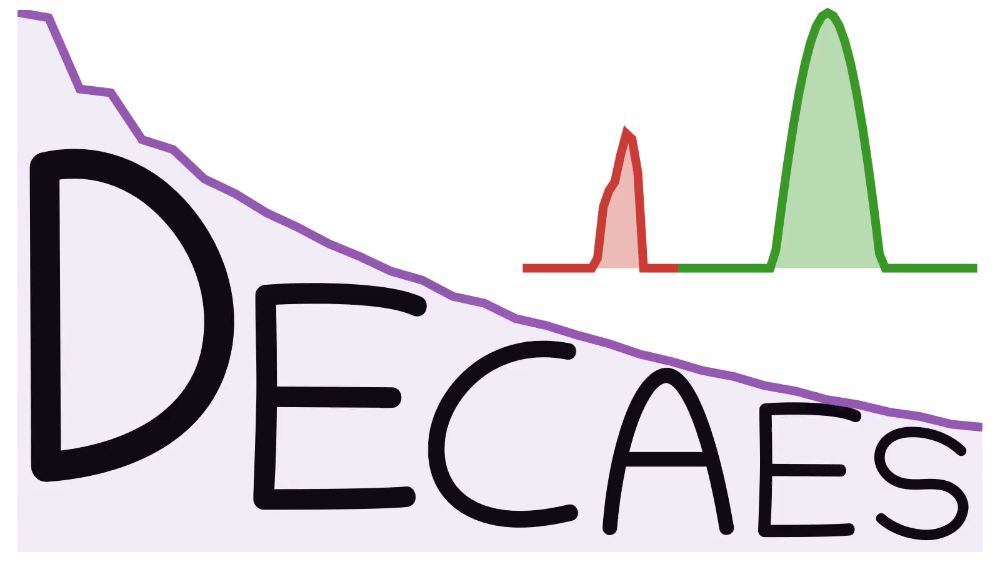

# DEcomposition and Component Analysis of Exponential Signals (DECAES)

<p align="left">  </p>

<!-- [](https://jondeuce.github.io/DECAES.jl/stable) -->
[](https://jondeuce.github.io/DECAES.jl/dev)
[](https://github.com/jondeuce/DECAES.jl)
<a href="https://doi.org/10.1016/j.zemedi.2020.04.001">  </a>
<!-- [](https://doi.org/10.1016/j.zemedi.2020.04.001) -->

[](https://github.com/jondeuce/DECAES.jl/actions/workflows/CI.yml?query=branch%3Amaster)
[](https://codecov.io/github/jondeuce/DECAES.jl/branch/master)

DECAES is a *fast* Julia package for computing voxelwise [T2-distributions](https://doi.org/10.1016/0022-2364(89)90011-5) from multi-spin echo MRI images using the extended phase graph algorithm with stimulated echo corrections.
It began as a port of the [MATLAB toolbox](https://mriresearch.med.ubc.ca/news-projects/myelin-water-fraction/) from the [UBC MRI Research Centre](https://mriresearch.med.ubc.ca/).
Post-processing of these T2-distributions allows for the computation of measures such as the [myelin water fraction (MWF)](https://doi.org/10.1002/mrm.1910310614) or the [luminal water fraction (LWF)](https://doi.org/10.1148/radiol.2017161687).

DECAES is written in the open-source [Julia programming language](https://julialang.org/).
Julia and command line interfaces are available through this package.
The [examples repository](https://github.com/jondeuce/mwiexamples) additionally provides a MATLAB interface via the MATLAB function [`decaes.m`](./api/decaes.m).

If you use DECAES in your research, please [cite our work](./CITATION.bib):

* Doucette J, Kames C, Rauscher A. DECAES - DEcomposition and Component Analysis of Exponential Signals. Zeitschrift für Medizinische Physik 2020; 30: 271–278.

## Installation

Install Julia v1.9 or later using the official [`juliaup`](https://github.com/JuliaLang/juliaup) installer, then run:

```bash
julia --project=@decaes -e 'import Pkg; Pkg.add("DECAES"); Pkg.build("DECAES")'
```

This will do two things:

1. Add DECAES.jl to a named Julia project environment separate from your global environment
2. Build the `decaes` launcher script at `~/.julia/bin` for running DECAES from the command line

DECAES can then be run as `decaes <COMMAND LINE ARGS>`.
Add `~/.julia/bin` to your `PATH` so the shell can find the launcher;
otherwise, invoke it using the full path `~/.julia/bin/decaes`.
Run `decaes --help` to list the available arguments.

## Quickstart

If you are new to DECAES, start with the [examples repository](https://github.com/jondeuce/mwiexamples), which provides:

* A walk-through tutorial for using the MATLAB and command-line DECAES interfaces
* Example multi-spin echo (MSE) data for demonstrating MWI processing

## Documentation

[](https://jondeuce.github.io/DECAES.jl/dev)

Find package documentation at the above link, which includes:

* A [command-line tutorial](https://jondeuce.github.io/DECAES.jl/dev/cli), including [available arguments](https://jondeuce.github.io/DECAES.jl/dev/cli/#Arguments) and examples
* A Julia API reference
* Internal API and algorithm documentation

## Benchmarks

DECAES is highly optimized and *fast*.
The table below shows example processing times for DECAES v0.7.0 on two multi-spin echo (MSE) datasets:

<center>

| Dataset     | Matrix Size     | CPU                          | Threads | `chi2`   | `reginska` | `lcurve` | `gcv`     |
| :---:       | :---:           | :---:                        | :---:   | :---:    | :---:      | :---:    | :---:     |
| 48-echo MSE | 240 x 240 x 48  | AMD Ryzen 9 3950X            | 32      | **2.9s** | **3.2s**   | **4.6s** | **6.2s**  |
| 56-echo MSE | 240 x 240 x 113 | AMD Ryzen 9 3950X            | 32      | **4.8s** | **5.3s**   | **7.2s** | **10.2s** |
| 48-echo MSE | 240 x 240 x 48  | AMD Ryzen Threadripper 3970X | 64      | **1.4s** | **1.6s**   | **2.2s** | **3.1s**  |
| 56-echo MSE | 240 x 240 x 113 | AMD Ryzen Threadripper 3970X | 64      | **2.3s** | **2.6s**   | **3.5s** | **5.1s**  |

</center>

Each timing is the fastest of three runs using the indicated `--Reg` method, `--nT2 40`, and otherwise default settings.
Timings include $T_2$ distribution and derived-metric computation but exclude I/O.

## DECAES Tutorial 2022

[](https://www.youtube.com/watch?v=xCKWWNywOTw)

## JuliaCon 2021

[](https://www.youtube.com/watch?v=6OxsK2R5VkA)

## Citing this work

If you use DECAES in your research, please [cite our work](https://doi.org/10.1016/j.zemedi.2020.04.001):

```tex
@article{DECAES.jl-2020,
  title = {{{DECAES}} - {{DEcomposition}} and {{Component Analysis}} of {{Exponential Signals}}},
  author = {Doucette, Jonathan and Kames, Christian and Rauscher, Alexander},
  year = {2020},
  month = may,
  issn = {1876-4436},
  doi = {10.1016/j.zemedi.2020.04.001},
  journal = {Zeitschrift Fur Medizinische Physik},
  keywords = {Brain,Luminal Water Imaging,MRI,Myelin Water Imaging,Prostate},
  language = {eng},
  pmid = {32451148}
}
```
